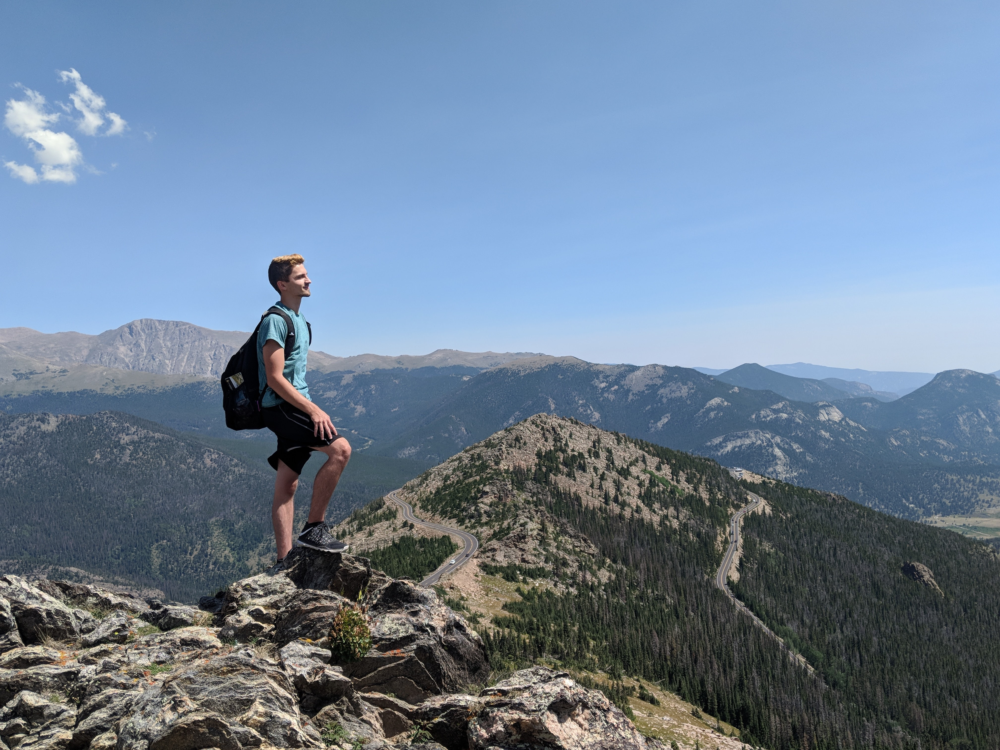

<h1 align="center">Hi , I'm Derek Szczepanik</h1>
 

  

<h3 align="center">A passionate fullstack developer from Denver, CO</h3>
<h3 align="center">Certification in Web Development from the University of Denver(2023)</h3>
 

  

 
<table width="100%">
  <tr>
    <td width="50%" valign="top" align="center">
      <h2 >👨‍💻 About Me</h2>
      
- 🌱 I’m currently learning React Native for mobile development.

      
- 💬 Ask me about Web Development, JavaScript, and Python!

      
- 📫 How to reach me: derekszcz45@gmail.com

    </td>
    <td valign="top" align="center">
      <h2 >Technologies: </h2>
      

        
      

    </td>
  </tr>
</table>
 

<table width="100%" >
  <tr width="100%">
    <td width="50%" align="center">
      
    </td>
  </tr>
  <tr width="100%">
    <td align="center">
      
    </td>
  </tr>
</table>
